> 注: この要約とmermaidダイアグラムはAIによって生成されたものであり、不正確な内容を含む可能性が高いです。正確な情報については必ず原著を参照してください。

## まえがき

- アーキテクチャの魅力は構造
    - 構造はソフトウェア開発のパラダイム
    - ソフトウェアは本質的に再起的でフラクタルのため、コードによってすべてが描き出されていく
        - すべては詳細
- 可視化されたものは選択肢に過ぎない
    - 特性や本質はそこにはない
- processor speed, network bandwidthは物理的制約となる
- 変更コストがアーキテクチャの重要性を計測する

## 序文

# Part 1 introduction

## Ch01 design, architecture

- 設計とアーキテクチャに違いはない
- 目的
    - 求められるシステムを構築・保守するために必要な人材を最小限に抑えること

## Ch02 2つの価値のお話

- 振る舞い
- 構造
- アーキテクチャ
    - ソフトウェアはソフトであるべき
- 大きな価値
    - 変更容易性が重要
- ソフトウェア開発者もステークホルダーであり、保護すべきソフトウェアに対する責任がある
- 機能よりも構造にフォーカス

# Part 2 構成要素から始めよ: プログラミングパラダイム

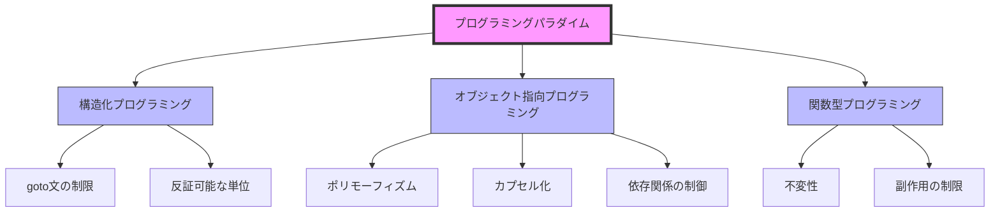

- パラダイム: どのプログラミング構造を使うべきか、それをいつ使うべきか教えてくれる

## Ch03 パラダイムの概要

- 構造化プログラミング
    - if/then/else, do/while/until
    - 直接的な制御の移行に規律を課すもの
        - goto文を奪う
- オブジェクト指向プログラミング
    - 間接的な制御の移行に規律を課すもの
        - 関数ポインタを奪う
- 関数型プログラミング
    - 不変性が基本概念
    - 代入に規律を課すもの
        - 代入を奪う
- 考えるべきこと
    - パラダイムは能力を削除
        - 何をすべきでないかを伝える
    - 1958年から1968年の10年間で発見されたもの
- まとめ
    - パラダイムが、コンポーネントの分離、データ管理、機能というアーキテクチャの3つの大きな関心ごとに対応している

## Ch04 構造化プログラミング

- 証明
    - 合理的な証明のための分割統治
    - 証明可能な単位に再帰的に分割
    - 順次、選択、反復
- 機能分割
    - 構造化プログラミングは、モジュールを証明可能な単位に再帰的に分割することを可能にする
        - これによりモジュールは機能的に分割できる
- 救済のための科学
    - 科学の理論や法則の本質: 反証可能
    - 科学は、真ではないことを証明することで機能している
- テスト
    - テストはバグが存在することを示すもの
    - 正しくないことの証明は、証明可能なプログラムにしか適用できない
    - 証明可能な小さな機能が正しくないことを、テストを使って証明する
- まとめ
    - 構造化プログラミングの価値を高めるのは、反証可能なプログラミングの単位を作成する能力
        - アーキテクチャレベルで機能分割がベストプラクティス
    - 最小の機能から最大のコンポーネントまで、あらゆるレベルで、ソフトウェアは科学のように反証可能性によって動かされている
    - 簡単に反証できる(テスト可能な)モジュール、コンポーネント、サービスを定義しようとする

## Ch05 オブジェクト指向プログラミング

- 優れたアーキテクチャの基本は、OOPの原則の理解と適用
- カプセル化
    - OO言語がデータと関数のカプセル化を簡単かつ効果的なものにしている
        - データと関数の周囲に線を引ける
    - Cで完璧にできていたカプセル化は弱体化されている
- 継承とは
    - OO言語によりデータ構造のなりすましが便利にはなっている
- ポリモーフィズムとは
    - 関数へのポインタの応用
    - ポリモーフィズムを安全かつ便利にしたのはOO言語
    - 関数へのポインタが危険で、規約が必要だが、OO言語がこの規約を排除して危険性を排除している
    - → OOは間接的な制御の移行に規律を課すもの
- ポリモーフィズムのパワー
    - OOならばプラグインアーキテクチャをどこでも何にでも使える
- 依存関係逆転
    - 具体的な実装とインターフェースの依存関係が、制御の流れと逆になっている
        - 具体的な実装がインターフェースに依存するが、制御ではインターフェースを見てから具体的な実装を見るということか？
    - OO言語が安全で便利なポリモーフィズムを提供しているというのは、ソースコードの依存関係はたとえどこにあっても逆転できることを意味する
    - <u>OO言語により、システムにあるすべてのソースコードの依存関係の方向を絶対的に制御できる</u>
        - 制御の流れによらず、ソースの依存関係を扱える
    - DB, UIをビジネスルールに依存させられる
        - DB, UIをビジネスルールのプラグインにできる
            - ビジネスルールのソースコードからUIやDBに言及することがなくなる
    - → ソースコードと同じ依存関係のまま、ビジネスルール, DB, UIの3つの異なるコンポーネントやデプロイユニットにまとめられる
        - ビジネスルールを含むコンポーネントは、UIやDBを含むコンポーネントに依存しない
    - ビジネスルールはUIやDBとは独立してデプロイできる
    - → 独立デプロイ可能性 → 独立開発可能性
- まとめ
    - **OOとは、ポリモーフィズムを使用することで、システムにあるすべてのソースコードの依存関係を絶対的に制御する応力**
    - → プラグインアーキテクチャを作成できる
        - **上位レベルの方針を含んだモジュールを、下位レベルの詳細を含んだモジュールから独立させられる**
    - 下位レベルの詳細はプラグインモジュールとなり、上位レベルの方針を含んだモジュールとは独立して、デプロイおよび開発できるようになる

## Ch06 関数型プログラミング

- 1930'sのアロンゾチャーチが発明したラムダ計算に基づく
- 整数の二乗
    - 関数型言語の変数は変化しない
- 不変性とアーキテクチャ
    - 可変変数が起こす問題
        - 競合状態、デッドロック状態、並行更新
    - → 並行処理のアプリケーションにおいて直面するあらゆる問題は、可変変数がなければ発生しない
    - ストレージとプロセッサ速度が無限にあれば、不変性は完全に有用
- 可変性の分離
    - 不変性に関する最も一般的な妥協
        - アプリケーションやアプリケーションのサービスを、可変コンポーネントと不変コンポーネントに分離すること
        - 並行性の問題に対して、トランザクショナルメモリを使うのが一般的
            - トランザクショナルメモリ: DBがディスクのレコードを扱うのと同じように、メモリ内の変数を扱うもの
                - 変数をトランザクションやリトライベースのスキームから保護してくれる
                - 比較と置換のアルゴリズム
                    - 簡単なアプリケーションには適している
            - 複雑になると、可変/不変コンポーネントの分離が重要
- イベントソーシング
    - 状態ではなくトランザクションを保存する
    - 状態はすべてのトランザクションを収集すればよい
    - CRUDがCRのみになり、並行更新の問題も発生しない
    - ソースコード管理システムと同じ
    - 十分な記憶容量と十分な処理能力があれば、アプリケーションは完全に不変にできる
- まとめ
    - 関数型プログラミングは、代入に規律を課す
    - ソフトウェア（コンピュータプログラムの本質）の構成要素
        - 順次、選択、反復、間接参照

# Part 3 設計の原則

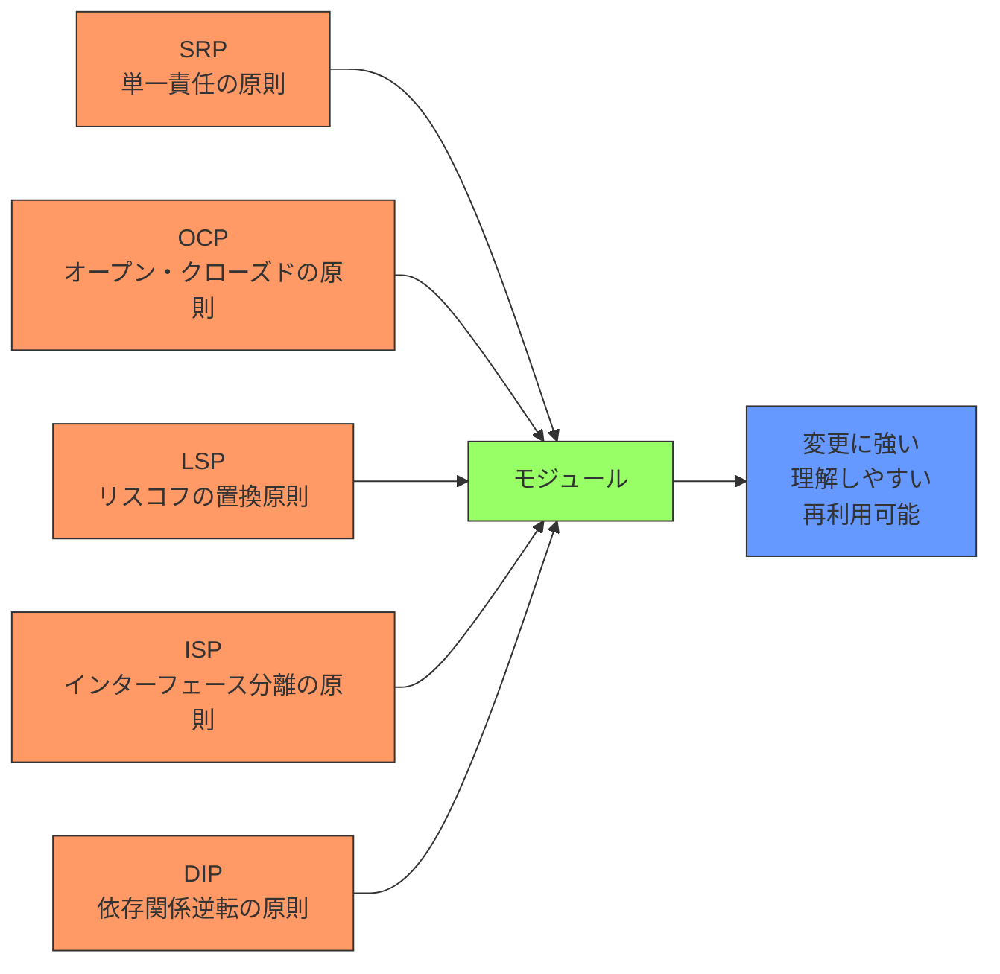

- よくできたソフトウェアシステムは、クリーンなコードを書くことから
- 加えて、SOLID_principleが必要
- SOLID_principleの目的は、以下のような性質を持つ中間レベルのソフトウェア構造を作ること
    - 変更に強いこと
    - 理解しやすいこと
    - コンポーネントの基盤として、多くのソフトウェアシステムで利用できること
- SOLID_principleはモジュールレベルの開発に使われる
    - コードレベルより上で、モジュールやコンポーネントで使うソフトウェア構造の定義に役立つ
- Single Responsibility Principle
    - 個々のモジュールを変更する理由がたったひとつだけになるように、ソフトウェアシステムの構造がそれを使う組織の社会的構造に大きな影響を受けるようにする
- Open-Closed Principle
    - ソフトウェアを変更しやすくするために、既存のコードの変更よりも新しいコードの追加によって、システムの振る舞いを変更できるように設計するべき
- Liskov Substitution Principle
    - 個々のパーツが交換可能となるような契約に従う必要
- Interface Segregation Principle(インターフェイス分離の原則)
    - 使っていないものへの依存を回避すべき
- Dependency Inversion Principle
    - 詳細側が方針に依存すべき

## Ch07 SRP

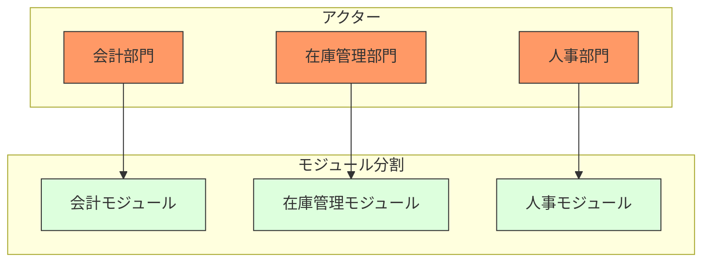

- モジュールを変更する理由はたったひとつだけであるべき
    - ユーザやステークホルダーのみ
- → <u>モジュールはたったひとつのアクターに対して責務を負うべき</u>
- モジュールは、いくつかの関数やデータをまとめた凝集性のあるもの
- <u>アクターの異なるコードは分割するべき</u>
    - データを関数から切り離し、各アクターごとに別のクラスをそれぞれ用意する
    - Facadeパターンで、具体的なクラスの追跡を不要にする
- まとめ
    - SRPは関数やクラスに関する原則
        - コンポーネントレベルではこの原則は閉鎖性共通の原則(CCP)と呼ばれる
        - アーキテクチャレベルではアーキテクチャの境界を作るための変更の軸と呼ばれる

## Ch08 OCP

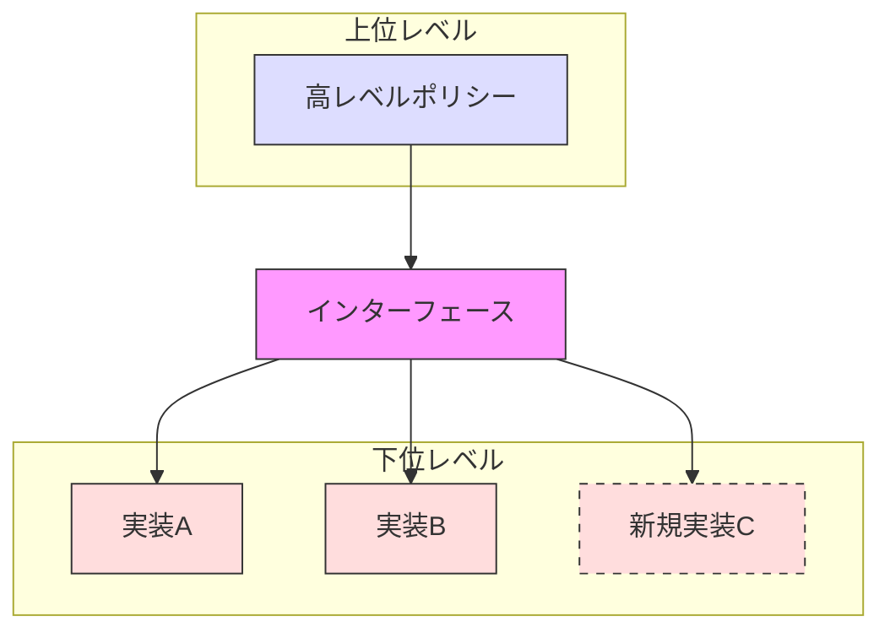

- ソフトウェアの構成要素は拡張に対しては開いていて、修正に対して閉じていなければならない
- コンポーネントのレベルを考慮するときにさらに重要になる原則
- SRP, DIPの適用が必要
- 処理をクラスに分割して、それぞれのクラスをコンポーネントにまとめる
    - Controller, Interactor, Databese, Presenter, View
    - すべての依存関係はソースコードに関するもの
    - コンポーネントを超える線がすべて一方通行
    - Interactorは特権的
        - ほかのコンポーネントの影響を受けず、OCPに最も適している
        - ビジネスルールを含んでいるため
        - アプリケーションの最上位レベルの方針を含んでいる。中心となる関心事を処理する
- 上位にあるコンポーネントは、下位レベルのコンポーネントが変更されても、変更不要
- 方向の制御
    - インターフェイスにより依存関係を逆転させている
- 情報隠蔽
    - 依存関係がある場合も、インターフェイスを使って推移的な依存関係を防ぐ必要がある
- まとめ
    - OCPはシステムのアーキテクチャの隠れた原動力
    - 目的: 変更の影響を受けずにシステムを拡張しやすくすること
    - 目的を達成するために、システムをコンポーネントに分割して、コンポーネントの依存関係を階層構造にする
        - そして、上位レベルのコンポーネントが下位レベルのコンポーネントの変更の影響を受けないようにする

## Ch09 LSP

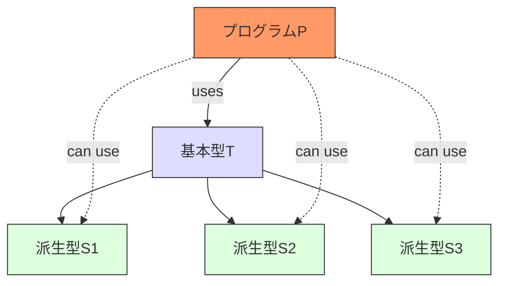

- 派生型
    - S型のオブジェクトo1の各々に、対応するT型のオブジェクトo2が1つ存在し、Tを使って定義されたプログラムPに対してo2の代わりにo1を使ってもPの振る舞いが変わらない場合、SはTの派生型であると言える
- LSPはオブジェクト指向における継承の使い方の指針となるだけでなく、適用範囲が広がり、インターフェースと実装に関するソフトウェアの原則となっている

## Ch10 ISP; インターフェース分離の原則

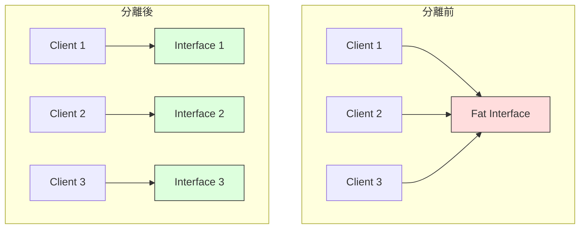

- 操作をインターフェースに分離することで、関係ない部分の変更について再コンパイルと再デプロイが不要になる
- 不要な依存関係は避ける

## Ch11 DIP

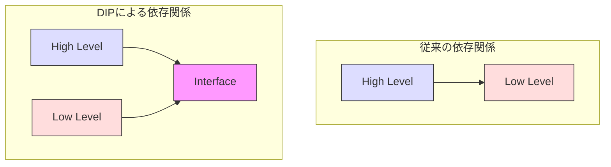

- ソースコードの依存関係が具象ではなく抽象だけを参照しているものが、最も柔軟なシステム
    - これがDIPの伝えていること
- OSやプラットフォーム周りは変化しないとみなしてよく、具象でも依存してOK
- インターフェースの変動性をできるだけ抑える
- プラクティス
    - 変化しやすい具象クラスを参照しない
        - Abstract_Factoryパターンを使う
    - 変化しやすい具象クラスを継承しない
    - 具象関数をオーバーライドしない
    - 変化しやすい具象を名指しで参照しない
- Factory, Abstract_Factory
    - 抽象コンポーネントには、すべての上位レベルのビジネスルールが含まれる
    - 具象コンポーネントには、ビジネスルールが操作する実装の詳細が含まれる

# Part 4 コンポーネントの原則

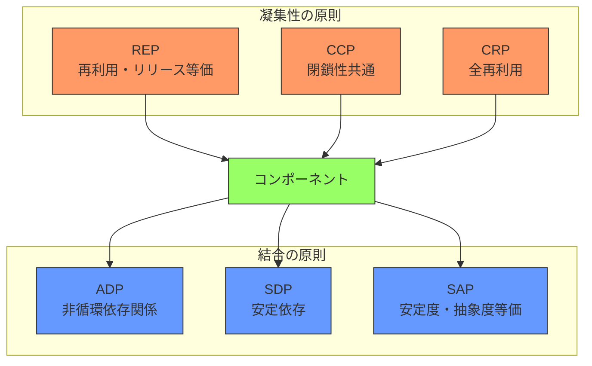

## Ch12 コンポーネント

- **コンポーネントとは、デプロイの単位**
- よくできたコンポーネントは常に個別にデプロイできる状態を保っているため、個別に開発できる
- リロケータビリティ
- ディスクやメモリの進歩によりリンクローダのアイデアが有効になった
- 動的にリンクされたファイルを実行時にプラグインできる。これがソフトウェアコンポーネント

## Ch13 コンポーネントの凝集性

- 再利用・リリース等価の原則（REP）
    - 再利用の単位とリリースの単位は等価になる
    - コンポーネントには一貫するテーマや目的があり、それを共有するモジュールを集める必要がある
    - 1つのコンポーネントを形成するクラスやモジュールは、まとめてリリース可能である必要
- 閉鎖性共通の原則（CCP）
    - 同じ理由、同じタイミングで変更されるクラスをコンポーネントにまとめること。
    - 変更の理由やタイミングが異なるクラスは、別のコンポーネントに分けること。
    - SRP(単一責任の原則)をコンポーネント向けに換言したもの
    - 再利用性より保守性が重要
    - 同じタイミングで変更されることが多いクラスは1つにまとめておく
    - OCP(オープン・クローズドの原則)とも密接に関連している
    - SRPとの類似点
        - 同じタイミング・同じ理由で変更するものはひとまとめにすること
        - 変更のタイミング・理由が異なるものは別々に分けること
- 全再利用の原則(CRP)
    - コンポーネントのユーザに対して、実際には使わないものへの依存を強要してはいけない
    - コンポーネントの一部のクラスを使うだけでも、依存性が弱まることはない
    - コンポーネントに依存するなら、コンポーネントに含まれるすべてのクラスに依存するようにしておく
    - インターフェース分離の原則（ISP）との関係
        - CRPはISPを一般化したもの
        - ISPは使っていないメソッドを持つクラスに依存しないように伝えている
        - 不要なものには依存しないことをどちらも伝えている
- 図13-1 凝集性に関する原則のテンション図
    - REPとCCPは包含関係にある
    - CRPはほか2つと相反する
    - 初期は再利用性を犠牲にしてCCPを重視する
    - プロジェクトが進むと、REPを重視する
- どのクラスをコンポーネントにまとめるか決めるときは、開発時の利便性と再利用性のトレードオフを考慮する必要がある

## Ch14 コンポーネントの結合

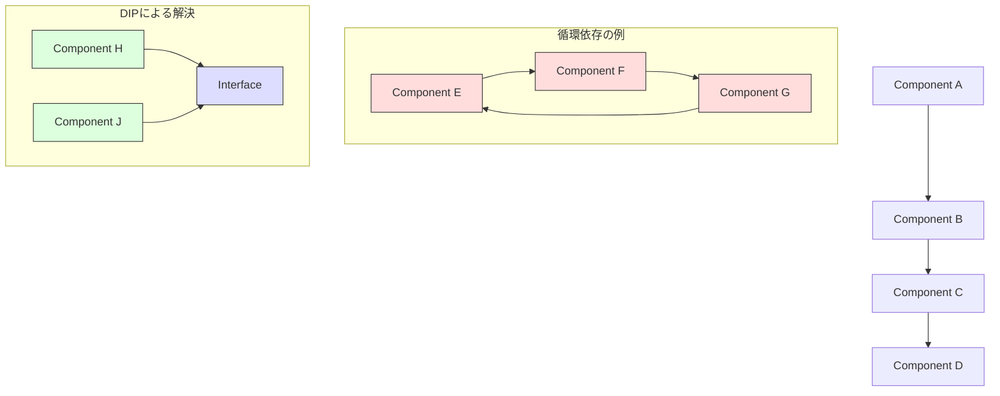

- 非循環依存関係の原則(ADP)
    - コンポーネントの依存グラフに循環依存があってはいけない
    - 依存関係を把握して、システムをビルドする方法もはっきりさせる
- 循環依存の解消
    - DIPを適用し、インターフェースを作って依存関係を逆転させる
    - 新しいコンポーネントを作る
- コンポーネント図はビルド可能性や保守性を見るためのもの
- 変動性の分離が最優先
    - 価値の高い安定したコンポーネントを、頻繁に変更されるコンポーネントから保護する
- コンポーネントの依存構造はシステムの論理設計に合わせて育てていくもの
- 安定依存の原則(SDP)
    - 手軽に変更できるように作ったモジュールが変更しづらいモジュールから依存されていないことを保証する
    - 安定度
        - 多数のコンポーネントから依存されたコンポーネントは非常に安定している
            - ほかのコンポーネントに依存しておらず外部要因で変更が必要にならない： 独立コンポーネント
        - 依存されておらず、多くのコンポーネントに依存しているコンポーネントは非常に不安定
            - 従属コンポーネントと呼ぶ
        - 指標
            - I(Instability, 不安定さ) = ファンアウト/（ファンイン＋ファンアウト）
                - ファンアウト: 依存出力数
                - ファンイン: 依存入力数
            - コンポーネントのIを依存するコンポーネントのIよりも大きくすべき
    - すべてのコンポーネントに高い安定度を求める必要はない
- <u>安定度・抽象度等価の原則(SAP)</u>
    - 安定度の高さが拡張の妨げにならないよう、安定度の高いコンポーネントは抽象度も高くあるようにするべき
    - 安定度の低いコンポーネントは具体的なものであるべき
    - 安定度を高めようとするなら、拡張できるようにインターフェースと抽象クラスで構成すべき
    - 抽象度が高くなる方向に依存すべき
    - 抽象度の計測
        - A(抽象度) = Na/Nc
            - Na: コンポーネント内の抽象クラスとインターフェースの総数
            - Nc: コンポーネント内のクラスの総数
    - I, Aともに低すぎる → 苦痛ゾーン
        - 変動性が低ければここで問題ない
    - I, Aともに高すぎる → 無駄ゾーン
    - (1, 0), (0, 1)を結ぶ直線を主系列と呼ぶ
        - <u>D(Distance) = |A+I-1|</u>
            - 0に近いほど○
            - 1を超えるものは考え直す必要ある

# Part 5 アーキテクチャ

## Ch15 アーキテクチャとは？

- アーキテクチャの形状の目的は、そこに含まれるソフトウェアシステムの開発・デプロイ・運用・保守を容易にすること
    - その戦略は、できるだけ長い期間、できるだけ多くの選択肢を残すこと
- ソフトウェアアーキテクチャの目的は、システムを単一のアクションで簡単にデプロイできるようにすること
- アーキテクチャが運用方法を明らかにする
    - システムのアーキテクチャは、システムに求められるUC、機能、振る舞いを、ファーストクラスのエンティティになるまで高める必要がある
- ソフトウェアの2つの価値
    - 振る舞いの価値
    - 構造の価値
    − ソフトウェアをソフトたらしめるもので、重要
- 重要ではない詳細について、できるだけ多くの選択肢を残すのが重要
- あらゆるソフトウェアシステムは、「方針」と「詳細」の2要素に大きく分割できる
    - 方針: ビジネスのすべてのルールや手順を含んでいる
        - システムの本当の価値がある

## Ch16 独立性

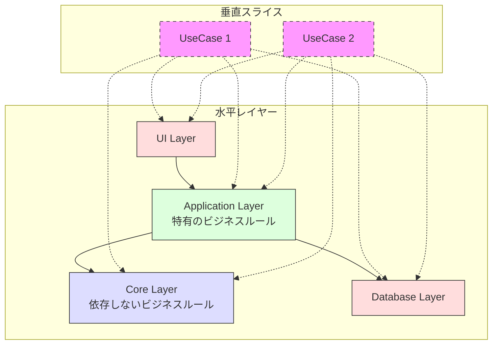

- コンウェイの法則: システムを設計する組織は、組織のコミュニケーション構造をコピーした構造の設計を生み出す
- 異なる理由で変更されるものを分離し、同じ理由で変更されるものをまとめる
- システムは切り離された水平レイヤーで分割されている
    - UI、アプリケーション特有のビジネスルール、アプリケーションに依存しないビジネスルール、DBなど
- ユースケースは、システムの水平レイヤーを薄く垂直にスライスしたもの
- ユースケースの切り離しは運用にも適用できる
    - 異なるスループットの要求などに対して、別々のサーバで実行させられる
    - マイクロサービス
- 本物の重複と偽物の重複がある
    - 偽物の重複はまとめてはいけない
- いざというときのために、サービスを作れそうなところまで切り離すのがおすすめ

## Ch17 バウンダリー: 境界線を引く

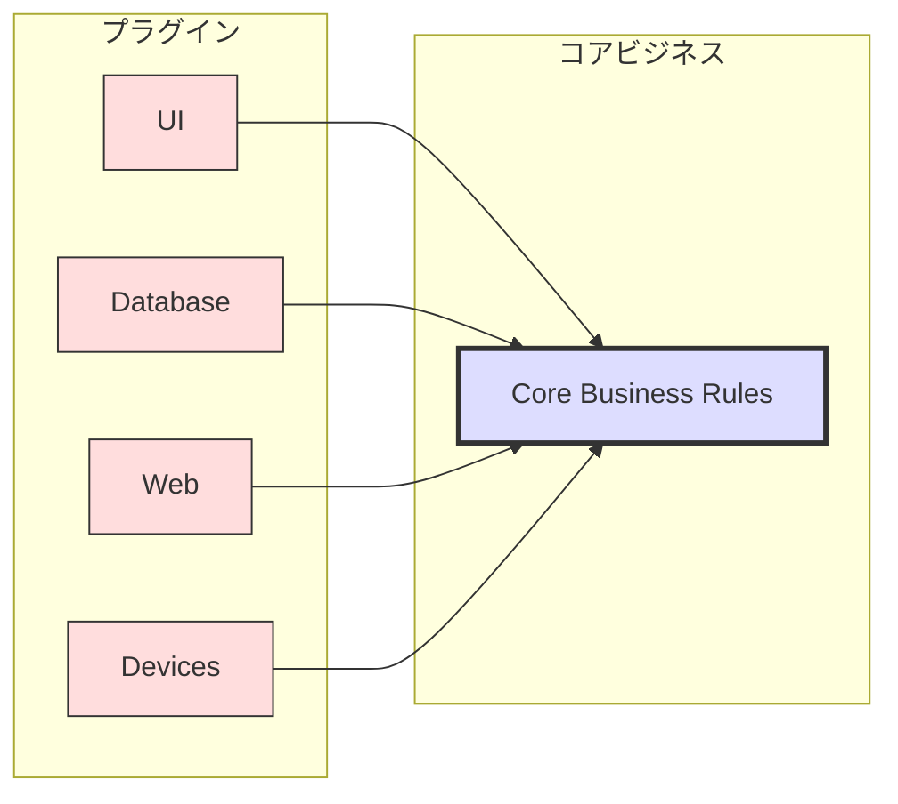

- 決定をできるだけ引き延ばす
- 選択を遅らせるための境界線
- プラグインによって、スケーラブルで保守可能なシステムアーキテクチャを確立する
- 境界線は変更の軸があるところに引く
    - 境界線を挟んで、変更の頻度や理由が変わる
    - → SRP
- ソフトウェアアーキテクチャに境界線を引くためには、まずはシステムをコンポーネント二分割する
− その中からいくつかのコンポーネントがコアのビジネスルールになる
    - 必要な機能が含まれているそのほかのコンポーネントは、コアのビジネスには直接関係しないので、プラグインにしておく
    − コンポーネントにコードを配置して、そこから一方向にコアのビジネスに向かって矢印を描く
- ↑ DIPとSAP（安定度。抽象度等価の原則）を適用したもの
- 依存性の矢印が詳細レベルから抽象レベルを指すようになっている

## Ch18 境界の解剖学

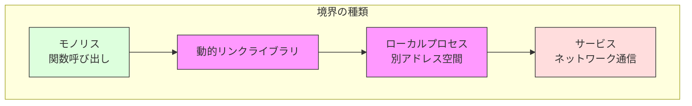

- 適切に境界を超えるには、ソースコードの依存関係の管理が必要
- モノリスのコンポーネント間の通信は単なる関数呼び出し
- アーキテクチャの境界の最も単純な物理的表現が、動的リンクライブラリ
- ローカルプロセスは、より強力な物理的なアーキテクチャの境界
    - アドレス空間は別々
    - ただし、境界を超える通信は高価
- 最も強い境界がサービス
    - サービスとは、一般的にコマンドラインや同等のシステムコールで開始されるプロセスのこと
    - サービスは物理的な場所に依存せず、あらゆる通信がネットワーク経由が前提
    - 上位レベルのサービスのソースコードに、下位レベルのサービスの物理的な情報は含めてはいけない
- モノリス以外のほとんどのシステムでは、複数の境界戦略を使う

## Ch19 方針とレベル

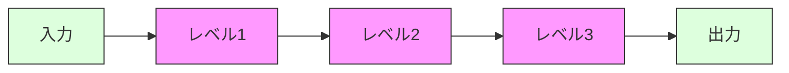

- ソフトウェアシステムは、方針を示したもの
    - コンピュータプログラムは、入力を出力に変換する方針を詳細に記述したもの
- レベルの厳密な定義は、入出力からの距離
- ソースコードの依存性はデータフローから切り離し、レベルと結びつけるべき

## Ch20 ビジネスルール

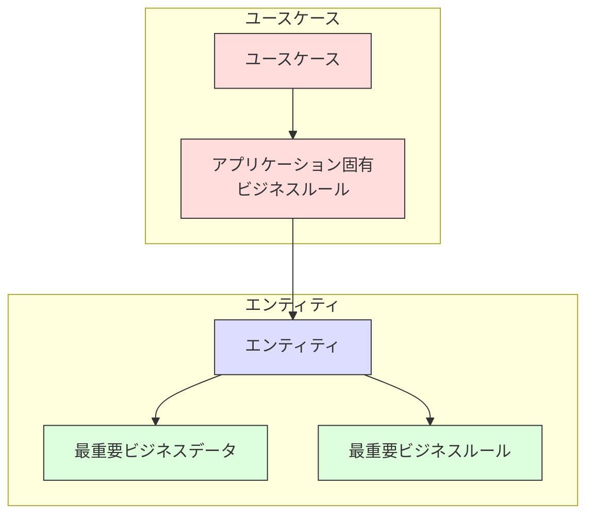

- システムが自動化されていなくても存在するものを、最重要ビジネスルール、最重要ビジネスデータと呼ぶ
- エンティティとは、最重要ビジネスデータを操作する最重要ビジネスルールをいくつか含んだもの
- エンティティオブジェクトには、最重要ビジネスデータかそれらのデータへの簡単なアクセス手段が含まれる
- エンティティのインターフェースは、そうしたデータを操作する最重要ビジネスルールを実装した関数で構成されている
- エンティティはビジネス以外のことを知る必要がない
- ユースケース: 自動化されたシステムの使い方を記述したもの
    - 手動の環境では使用されず、自動化されたシステムの一部としてのみ意味があるもの
    - ユーザから提供された入力、ユーザに戻す出力、出力を生成する処理ステップなどを規定
    - アプリケーション固有のビジネスルールを記述する
    - エンティティの最重要ビジネスルールをいつ・どのように呼び出すかを規定したルールが含まれている
    - UIについては記述してはいけない
    - ユースケースはシステムのユーザに対する見た目を記述するものではない
    - ユーザとエンティティのインタラクションを支配するアプリケーション固有のルールを記述したもの
    - 入出力データ、それらがやり取りする適切なエンティティへの参照といったデータ要素を持つ
    - ユースケースはアプリケーション固有なので、システムの入出力と近く、エンティティよりは下位になる
    - 入力としてシンプルなリクエストデータ構造を受け取り、出力としてシンプルなレスポンスデータ構造を戻す
        - リクエストとレスポンスのモデルは独立している必要がある

## Ch21 叫ぶアーキテクチャ

- アーキテクチャはフレームワークに関するものではない
- 優れたアーキテクチャはユースケースを中心にしている
- アプリケーションをWebで提供するという事実は詳細であり、システムアーキテクチャは提供方法を知るべきでない
- フレームワークにアーキテクチャを乗っ取られてはいけない
- フレームワークを使うことなく、すべてのユースケースのユニットテストが実行できるはず
- アーキテクチャは、システムで使うフレームワークではなく、システムそのものについての情報を伝える必要がある

## Ch22 クリーンアーキテクチャ

- 過去のシステムのアーキテクチャに関するアイデア
    - ヘクサゴナルアーキテクチャ
    - DCIアーキテクチャ
    - BCE
- いずれも関心事の分離という同じ目的を持っている
    - ソフトウェアをレイヤに分割することでこの分離を実現している
- 特性
    - フレームワーク非依存
    - テスト可能
    - UI非依存
    - DB非依存
    - 外部エージェント非依存
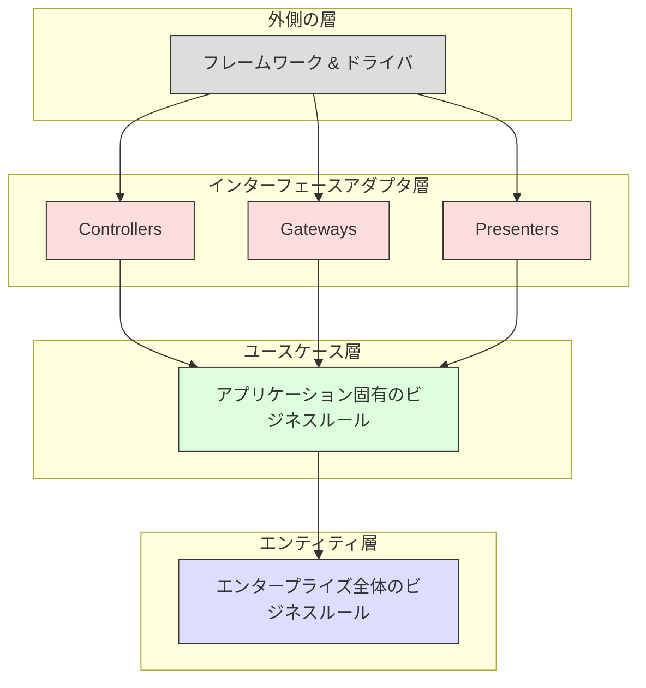
- アーキテクチャを動作させる最も重要なルールは、依存性のルール
    - ソースコードの依存性は、内側だけに向かっていなければならない
- エンティティ
    - 外部でなにか変化が起きても、変化する可能性が低い部分
    - 企業全体の最重要ビジネスルールをカプセル化したもの
- ユースケース
    - アプリケーション固有のビジネスルールを含む
    - エンティティに入出力するデータの流れを調整し、エンティティに最重要ビジネスルールを使用するように指示を出す
    - アプリケーションの操作の変更が影響を与えて変更が必要になることがある
- インターフェースアダプタ
    - ユースケースやエンティティに適したフォーマットから、DBやWebなどの外部エージェントに適したフォーマットにデータを変換するアダプタ
    - MVCアーキテクチャもこのレイヤにすべて入る
- フレームワークとドライバ
    - 円の次の内側とやり取りするグルーコードくらいしか書かない
- 内側は、抽象化して方針をカプセル化する
- 動的なポリモーフィズムを活用して、制御の流れとは反対のソースコードの依存関係を生み出す
- 境界線を超えて渡すのは、独立した単純なデータ構造にする
- 境界線を超えてデータを渡すときは、常に内側の円にとって便利な形式にする
- ソフトウェアをレイヤに分割して、依存性のルールを守れば、本質的にテスト可能なシステムを作り、それがもたらすメリットを受け取ることができる

## Ch23 プレゼンターとHumble_Object

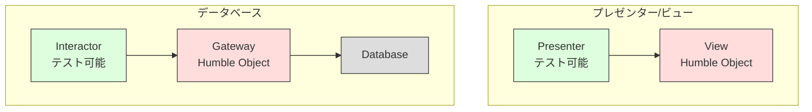

- Humble_Objectパターンは、ユニットテストを実行する人が、テストしにくい振る舞いとテストしやすい振る舞いを分離するために生み出されたデザインパターン
    - 振る舞いを2つのモジュールまたはクラスに分割するだけ
    - プレゼンターとビュー
        - ビューはテストが難しいHumble_Objectであり、コードをできるだけシンプルに保つ
        - プレゼンターはテスト可能なオブジェクト
    - DBゲートウェイはHumble_Object
        - インタラクターがテスト可能
        - ゲートウェイをスタブやテストダブルに置き換えられる
    - ORMはデータマッパーと呼ぶほうが適切
        - データ構造は、振る舞いを持たないデータの変数の集合
        - DBのレイヤに置かれ、ゲートウェイインターフェースとDBの間にHumble_Objectの境界を作る
    - サービスリスナー
- 境界を超える通信には、シンプルなデータ構造が含まれている
- 境界はテストしにくい部分とテストしやすい部分に分割する

## Ch24 部分的な境界

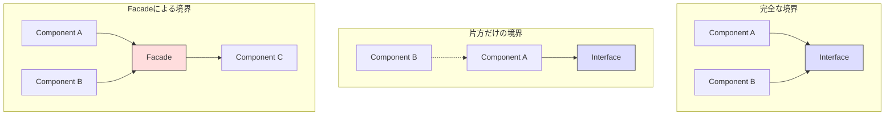

- 部分的な境界を構築する1つの方法は、独立してコンパイルやデプロイが可能なコンポーネントを準備したあとで、それらを同じコンポーネントにまとめるというもの
- 片方だけの境界は双方向の分離の維持よりはコストが少ないが、分離の劣化の可能性が残る
    - Strategyパターンの例
- Facadeパターンでは、依存関係の逆転も断念する
    - 推移的な依存関係が生じる
- 完全な境界に至るまでの代理として、特定の状況では適切になる

## Ch25 レイヤと境界

- 変更の軸によって定義される、潜在的なアーキテクチャの境界が存在する
- アーキテクチャの境界が必要なところになかったとしたら、境界を追加するコストやリスクは非常に高いものになる

## Ch26 メインコンポーネント

- Mainはアプリケーションのプラグイン
    - 初期状態や構成を設定して、外部リソースを集め、アプリケーションの上位レベルの方針に制御を渡すプラグイン
    - アプリケーションの設定ごとに複数のMainコンポーネントを持つこともできる
    - Mainをアーキテクチャの境界の背後にあるプラグインとして考えると、設定の問題は解決しやすくなる

## Ch27 サービス: あらゆる存在

- サービスは、プロセスやプラットフォームの境界を超える関数呼び出しに過ぎない
- Template Method, Strategyなどのパターンによる抽象化
    - Factoryにより機能ごとのクラスを作成する
- アーキテクチャの境界は、サービスとサービスの中間ではなく、サービスを横断してコンポーネントに分割している
- サービスはデータレコードと強く結びついていて、間接的に相互に結びついている
- サービスのインターフェースは、関数と比べると、正式なものではなく、厳密なものではなく、明確に定義されているものでもない
- データや振る舞いが結びついている限り、開発・デプロイ・運用には調整が必要

## Ch28 テスト境界

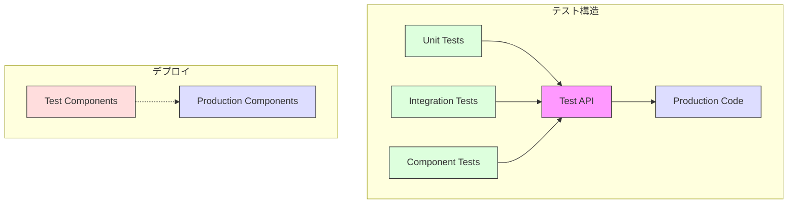

- テストはアーキテクチャの円の最も外側にある
- 変化しやすいものに依存しないテストを設計する
- テストAPIを作成して、テストをアプリケーションから分離する
    - アプリケーションの構造からテストの構造を切り離す
- テストAPIにより、時間経過に伴って、テストが具体的かつ個別化する一方で、プロダクションコードは抽象的かつ一般化するという進化の分離を助ける
- テストAPIのスーパーパワーはプロダクションシステムにデプロイされると危険なので、テストAPIとその危険な実装部分は、独立してデプロイ可能な個別のコンポーネントに入れておく必要がある

## Ch29 クリーン組み込みアーキテクチャ

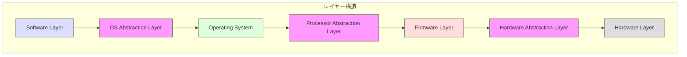

- ファームウェア: ソフトウェアとハードウェアとやり取りするコード
- ファームウェアは、ハードウェアの進化に合わせてどれだけ変化しにくいかで決まる
- 本当に必要なのは、ファームウェアを少なくして、ソフトウェアを多くすること
- ソフトウェアを構築する3つの活動
    - まずは動作させる。
    - それから正しくする。
    - それから高速化する。
- HAL: ハードウェア抽象化レイヤ
- クリーン組み込みアーキテクチャは、デバイスアクセスレジスタを限られた場所から使用して、完全にファームウェアに閉じ込めておく
- マイクロコントローラを使用するときは、低レベル機能をPAL（プロセッサ抽象化レイヤ）でファームウェアから分離しておく
- OSはソフトウェアをファームウェアから分離するレイヤ
- OSAL(OS抽象化レイヤ)でソフトウェアをOSから分離する
    - オフターゲットのテストを簡単にする継ぎ目や置換点ができる
- ヘッダーファイルの内容は、関数宣言と関数が必要とする定数や構造体の名前だけに制限すべき

# Part 6 詳細

## Ch30 DBは詳細

- DBシステムが普及した理由はディスクの遅さ
- DBは、ディスクとRAMとの間でデータを移動する仕組みに過ぎない
- データの構造であるデータモデルは、アーキテクチャ的に重要
    - DBシステムはアーキテクチャ的に重要でない

## Ch31 Webは詳細

- Webは入出力デバイスの一種と考えられる
- UIとアプリケーションの間の境界について抽象化する

## Ch32 フレームワークは詳細

- プロキシを用意して、プロキシを含めたコンポーネントをビジネスルールにプラグインすればよい
- フレームワークをコアのコードに混ぜない

## Ch33 事例: 動画販売サイト

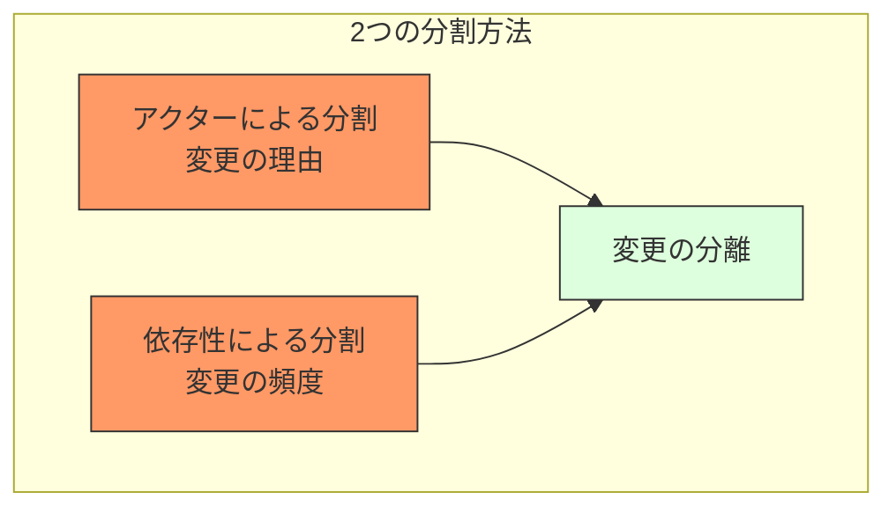

- システムの最初のアーキテクチャを決めるための第一歩は、アクターとユースケースを見つけること
- あるアクターの変更がほかのアクターたちに影響を及ぼさないようにする
- デプロイ方法を柔軟に変更して対応できるようにする
- SRPに基づくアクターによる分割と、依存性のルールによる分割
    - <u>どちらの分割も、変更の理由や頻度が異なるものを分離することが目的</u>
    - 変更の理由に対応するのがアクターによる分割
    - 変更の頻度に対応するのは方針のレベルの違い
- デプロイ可能な単位でコンポーネントをまとめられ、まとめ方の変更もしやすい

## Ch34 書き残したこと

- レイヤードアーキテクチャと機能によるパッケージングはそれぞれ足りていないところがある
- ポートとアダプター: ビジネス（ドメイン）に関するコードを技術的な詳細（フレームワークやDB）から切り離すこと
- DDDの世界では、内側に属するものはすべてユビキタス言語で名付けることが推奨されている
- レイヤードアーキテクチャの目的は、同じ種類の機能を持つコードを切り離すこと
- CQRSパターンなど以外では、レイヤーを飛び越えた依存は望ましくない
- 粒度の粗いコンポーネントに関するすべての責務を1つのコンポーネントにまとめる
    - コンポーネントによるパッケージング
    - ソフトウェア・システムをサービス中心に捉えた考え方
    - UIを粒度の粗いコンポーネントから切り離す
    - ビジネスロジックと永続化コードを1つにまとめてコンポーネントにする手法
- C4ソフトウェアアーキテクチャモデル
    - コンテナやコンポーネントやクラス（コード）の観点からソフトウェアシステムの静的構造を考えるシンプルで階層的な方法
- 設計をコードの構造にマッピングする方法、コードをとりまとめる方法、実行時とコンパイル時に依存性を分割する方法について考えてみる

# LT用

## クリーンアーキテクチャとは

- 突き詰めた目的は、求められるシステムを構築・保守するために必要な人材を最小限に抑えること
- 達成したいことは、変更の頻度や理由が変わるところに境界線を引き、スケーラブルで保守可能なシステムアーキテクチャを確立すること
    - たとえば、DBやフレームワークなどの技術的な詳細をプラグインとして扱えるようにして、コアのビジネスを詳細の変更から守ることなど

## クリーンアーキテクチャを実現する考え方

- 単一責任の原則(Single Responsibility Principle)
    - 個々のモジュールを変更する理由がたったひとつだけになるように、ソフトウェアシステムの構造がそれを使う組織の社会的構造に大きな影響を受けるようにする
    - モジュールを変更する理由はたったひとつだけであるべき
    - アクターの異なるコードは分割するべき
        - アクター: ソフトウェアの変更を望む人たちをひとまとめにしたグループ
    - コンポーネントレベルではこの原則は閉鎖性共通の原則(CCP)と呼ばれる
    - アーキテクチャレベルではアーキテクチャの境界を作るための変更の軸と呼ばれる
- オープン・クローズドの原則(Open-Closed Principle)
    - 目的: 変更の影響を受けずにシステムを拡張しやすくすること
    - 目的を達成するために、システムをコンポーネントに分割して、コンポーネントの依存関係を階層構造にする
    - 上位レベルのコンポーネントが下位レベルのコンポーネントの変更の影響を受けないようにする
- 依存関係逆転の原則（Dependency Inversion Principle）
    - 安定したソフトウェアアーキテクチャは、変化しやすい具象への依存を避け、安定した抽象インターフェイスに依存すべきである
    - インターフェースの変動性をできるだけ抑える
- 再利用・リリース等価の原則(Reuse/Release Equivalence Principle)
    - 再利用の単位とリリースの単位は等価になる
    - コンポーネントには一貫するテーマや目的があり、それを共有するモジュールを集める必要がある
- 閉鎖性共通の原則(Common Closure Principle)
    - 同じ理由、同じタイミングで変更されるクラスをコンポーネントにまとめること
    - 変更の理由やタイミングが異なるクラスは、別のコンポーネントに分けること
- 全再利用の原則(Common Reuse Principle)
    - コンポーネントのユーザに対して、実際には使わないものへの依存を強要してはいけない
    - コンポーネントに依存するなら、コンポーネントに含まれるすべてのクラスに依存するようにしておく

## クリーンアーキテクチャの具体例

## 余談: プログラミングパラダイムについてのキーセンテンス

- 構造化プログラミングの価値を高めるのは、反証可能なプログラミングの単位を作成する能力
- オブジェクト指向によりプラグインアーキテクチャを作成できる
- 関数型プログラミングは、代入に規律を課す
