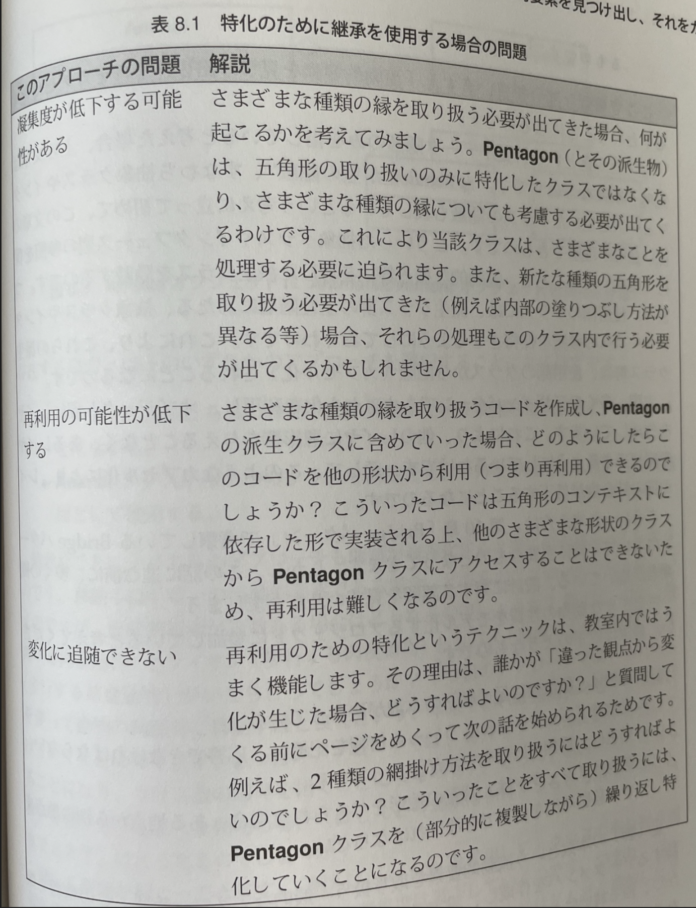
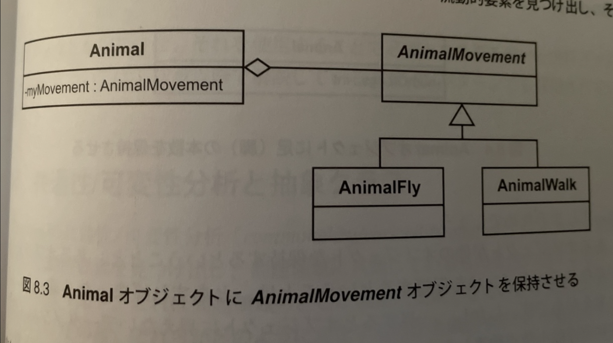

## オブジェクト: 従来からの考え方と新たな考え方

オブジェクトとは、操作(メソッド)を伴ったデータであるというのが従来からの考え方だった。

概念上の観点に基づいた、より有益な定義を導入する。この観点に基づいた場合、オブジェクトは責務を備えた実体であると定義できる。この責務によってオブジェクトの振る舞いが定義される。

この定義により、オブジェクトが何を実行するのかに着目できるようになる。このため、以下の手順に従ってソフトウェアを開発できるようになる。

1. 詳細をすべて考慮することなく、予備的な設計を行う。
2. その設計を実装する。

オブジェクトが実行することに着目することで、早すぎるタイミングで実装の詳細について考慮する必要がなくなる。実装の詳細を隠蔽できる。

これを可能にするのは、着目すべき対象をオブジェクトの公開インターフェースのみに絞り込めるため。オブジェクトに実行してほしいことはすべて、公開インターフェースという通信窓口を通じて依頼することになる。優れた公開インターフェースを持つオブジェクトに対しては、その責務範囲内にありさえすれば、どんな作業でも安心して依頼できる。

実装ではなく動機に着目するというのは、デザインパターンにおいて何度も出てくるスローガン。実装をインターフェースの背後に隠蔽することで、実装とそれを使用するオブジェクトを分離することになる。

## カプセル化: 従来からの考え方と新たな考え方

データ隠蔽は、カプセル化の限られた一面でしかない。

カプセル化とは、「あらゆるものを隠蔽すること」であると考えるべき。以下のものを隠蔽できる。

- データ
- 実装
- 派生クラス
- 設計の詳細
- 実体化の規則

実装をインターフェースの背後に隠蔽するというのも、実装を「カプセル化」するということ。図8.1のクラス図を考えてみる。

この図にはさまざまな種類のカプセル化が含まれている。

- データのカプセル化: 各サブクラスの保持するデータは、それ自体以外のすべてのものから隠蔽される。
- メソッドのカプセル化: CircleのsetLocation()はメソッドとしてカプセル化されている。
- その他オブジェクトのカプセル化: Circle以外は、XXCircleのことを関知できない。
- 型のカプセル化: Shapeのクライアントからは、サブクラスを区別できない。

型のカプセル化は、ポリモーフィズムを使用する抽象クラスとその派生クラス(またはインターフェースとその実装)によって生み出される。GoFのカプセル化はほとんどは型のカプセル化を意味している。

カプセル化をこのように幅広い視点で考えると、プログラムの分解(分割)時にメリットが生じる。つまり、カプセル化のレイヤが設計すべきインターフェースと一致する。クライアントプログラムへ影響することなく変更が可能になる。

特化のための継承には表8.1に示す問題がある。

## 流動的要素を見つけ出し、それをカプセル化する

- GoFの説明
    
    設計において、何を流動的要素とするべきか考察する。再設計せずに何を変更可能にするかを考える。個々で着目しているのは、流動的概念のカプセル化。多くのデザインパターンのテーマにもなっている。
    

ここの、「流動的要素を見つけ出し、それをカプセル化する」ことが重要

抽象クラスやインターフェース型の参照を保持(集約)することで、流動的な振る舞いを有した派生クラスを隠蔽する。使用側のクラスは、派生クラス群の上位階層にあたる、抽象クラスやインターフェースへの参照を保持させる。これにより、派生クラス群は使用側のクラスから隠蔽(カプセル化)されていることになる。

まさにレイヤードアーキテクチャが良い例

歩行と飛翔という2つの異なった移動手段(メソッド)がある場合、以下のいずれかの(誤った)アプローチが考えられる。

- オブジェクトにどちらの移動手段が有効化という情報を格納するデータメンバーを用意する。
- Animalクラスから2つのクラスを派生させ、一方を歩行用、もう一方を飛翔用として使用する。

これらのアプローチは問題が複雑化すると壁に突き当たる。移動手段が唯一の流動的要素である場合はうまくいく。しかし流動的要素が複数あると、1つ目のアプローチでは、switchを使って動物の種類ごとに無関係な流動的要素同士を関連付ける必要が生じる。2つ目のアプローチでは、特殊なケースごとに継承を使用することになり、クラス数の爆発を招く。状況に応じて歩行か飛翔か選択する場合も扱えない。

switchなどを使って、クラスの取り扱う流動的要素が増えるに従い、コードの凝集度が低下する。コード内に特殊ケースがどんどん増えて、理解しにくいコードになる。

良いアプローチが図8.3。AnimalMovementが振る舞いを表現・隠蔽している。

オブジェクトを保持させ、それを使用することで必要となる振る舞いを実行させるという戦略は、次章以降のデザインパターンでも採用されている。

## 共通性/可変性分析と抽象クラス

Coplienの共通性/可変性によって、問題領域中の流動的要素を見つけ出し、問題領域に共通しているものを洗い出せる。これは問題領域のどこが流動的要素となるのかを識別し(「共通性分析」)、その後、それらがどのように変化するのかを識別する(「可変性分析」)というもの。Coplienは、共通性分析を「ファミリ構成員の同一性を理解する上で役立てることがでkりう共通要素の発見作業」であると述べている。ある状況や実行機能に現れる互いに関連のある要素を「ファミリ構成員」と呼んでいる。ものごとがどれだけ共通しているのかを見つけ出すプロセスによって、それら要素の属するファミリ(そして流動的要素)が定義できる。たとえば、ホワイトボード用マーカー、鉛筆、ボールペンがあった場合、それらの共通点は「筆記用具」であるとわかる。こういった共通性(筆記用具)がわかったならば、さまざまな筆記用具の違い(材質、形状など)は簡単に考察できる。

次に可変性分析によって、ファミリ構成員がどのように違っているのかを明らかにする。可変性は、特定の共通性内でのみ意味を持つ。

> 共通性分析は時が経っても変化しにくい構造を見つけるもの。可変性分析は変化しやすい構造を洗い出すもの。可変性分析は、それに対応する共通性分析によって定義されたコンテキスト内においてのみ意味を持つ。アーキテクチャ的観点から見た場合、共通性分析によってアーキテクチャの寿命が延び、可変性分析によって使用に際した適応力が導き出される。
> 

問題領域中の特定部分に流動的要素がある場合、共通性分析によってそれらをまとめる概念を定義できる。こういった概念は抽象クラスによって表現できる。可変性分析によって洗い出された流動的要素は、具象クラスによって実装される。

図8.5では以下の関係を示している。

- 共通性分析と可変性分析
- 概念上の観点、仕様上の観点、実装上の観点
- 抽象クラス、インターフェース、派生クラス

図8.5が示しているように、共通性分析は問題領域における概念上の観点と関係があり、可変性分析は実装上の観点(特殊ケース)と関係がある。

仕様上の観点により、概念的ににたオブジェクト群との通信方法を描写できるようになる。仕様上の観点から、抽象クラスや、実装レベルにおけるインターフェースを導き出せる。

こういった角度からオブジェクト指向設計を見ると、表8.2にまとめた内容を主張できる。

これにより、クラス設計作業は表8.3のような2つの手順になる。

仕様上の観点と概念上の観点は、次のような関連を持っている: 仕様上の観点によって、ある概念に存在するケースすべてを取り扱うためのインターフェースを洗い出せる(つまり共通性によって、概念上の観点が定義される)。

そして、仕様上の観点と実装上の観点の関係は、次のようになる: ある仕様が与えら得た場合、その特定ケース(可変し絵)における実装方法を決定できる。

## アジャイル開発における品質

デザインパターンによるアプローチは、しばしば「事前の設計」と呼ばれる。これは問題領域中に存在する大きな概念を手がかりにして、徐々に細分化していくことを提唱しているため。これはエクストリームプログラミング(XP)と一見相反する。

しかし、XPとデザインパターンは相互補完的なものである。効率よく、堅牢で柔軟なコードという目標をこれにより達成する。

XPもデザインパターンも、コードに対して同じ品質を要求している。2つのアプローチは道こそ違えど同じ頂上を目指している。XPが求める、低い冗長性、可読性、テスト可能性といったものは、デザインパターンが実現するカプセル化による結合度の低減と高い相関にある。

何らかの規則を実装する場合、1箇所にまとめるという非常に重要な実装上の戦略がある。Kent Beckが「OAOO(Once And Only One: 一度だけ)ルール」という表現で推進している。以下の制約からOAOOルールを定義している。

- システム(コードとテストをまとめたもの)は、あなたが連携させたいと考えているものすべてと連携できなければならない。
- システム内に重複したコードがあってはならない。

言い換えると、何らかの規則がある場合、その実装は一度だけにとどめるということ。重複を許してしまうと、システムを修正する際に、該当箇所を1箇所も忘れることなくすべて修正するという難しい作業を強いられる。

冗長性と結合度は密接に関連しあっている。冗長なコードが存在している場合、一方のコードを変更しなければならないときは、もう一方のコードも変更しなければならないことが多い。このため、冗長なコードは結合度も高くなっていると言える。

可読性も凝集度の高さと深い関連がある。Ron Jeffriesは「意図によるプログラム」を提唱している。簡単に説明すると、コーディング時に何らかの機能が必要になった場合、それが既にあるものと考え、「意図を明らかにする名前」をつけ、それをメソッドとして呼び出し、とにかく作業を前に進ませる(メソッドは後で実装する)ということになる。コーディングとは、用途が明確にわかるような名前の付いた帰納を順番に呼び出していく作業となる。

この結果、モジュールのレベルが大きくなり、読みてはこまごました実装を追いかけるのではなく、コードの意図を理解できるようになる。コードが非常に読みやすくなる。より短く、より簡潔な凝集度の高いメソッドが生み出される。

意図によるプログラミングは、デザインパターンが要求している「インターフェースを用いて設計を行う」という考え方と非常によく似ている。「意図を明らかにする名前」を作成する際には、実装を気にすることなくインターフェースを考えることになる。

XPにおけるテストファーストのメリット

- 自動的にテストを実行するためのデータ一式が生み出される。
- メソッドの実装ではなく、メソッドのインターフェースを用いた設計が強制される。メソッドのカプセル化が促進され、結合度が低下する。
- テストに焦点を合わせることで、テスト可能な単位での機能分割が促される。高い凝集度と低い結合度が実現できる。

テスト可能なコードとは、他のモジュールや実体との結合方法について気にする必要がなく、独立してテストを行えるコードを指す。
