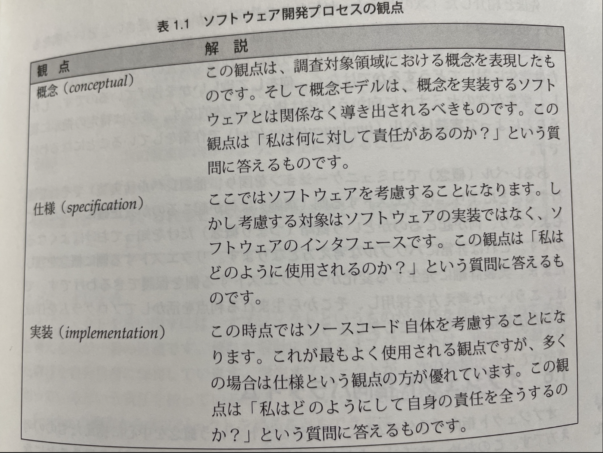

## Ch01 オブジェクト指向パラダイム

問題領域を理解するためにパターンを使う。

凝集度とはルーチン内の演算がどれだけ密接に関係しているかを表す尺度である。

結合度とは、2つのルーチン間の関連の強さを表す尺度であり、凝集度を補完するものである。凝集度は、ルーチン内の中身がどれだけ強く関連し合っているのかを示すものである。結合度はあるルーチンが、他のルーチンとどれだけ強く関連しあっているのかを示すものである。目標は、内部が完全(高い凝集度)、小さく、直感的であり、視認性が高く、他のルーチンとの関係が柔軟になる(低い結合度)ルーチンを作ることにある。



リクエストする側は、概念だけを知っておけば良くなる。

オブジェクト指向とは、問題領域を機能に分解していくのではなく、オブジェクトに分解していく。


## Ch08 視野を広げる

着目すべき対象をオブジェクトの公開インターフェースのみに絞り込めるため。オブジェクトに実行してほしいことはすべて、公開インターフェースという通信窓口を通じて依頼することになる。優れた公開インターフェースを持つオブジェクトに対しては、その責務範囲内にありさえすれば、どんな作業でも安心して依頼できる。

特化のための継承には表8.1に示す問題がある。


switchなどを使って、クラスの取り扱う流動的要素が増えるに従い、コードの凝集度が低下する。コード内に特殊ケースがどんどん増えて、理解しにくいコードになる。

良いアプローチが図8.3。AnimalMovementが振る舞いを表現・隠蔽している。


問題領域中の特定部分に流動的要素がある場合、共通性分析によってそれらをまとめる概念を定義できる。こういった概念は抽象クラスによって表現できる。

何らかの規則を実装する場合、1箇所にまとめるという非常に重要な実装上の戦略がある。Kent Beckが「OAOO(Once And Only One: 一度だけ)ルール」という表現で推進している。

言い換えると、何らかの規則がある場合、その実装は一度だけにとどめるということ。重複を許してしまうと、システムを修正する際に、該当箇所を1箇所も忘れることなくすべて修正するという難しい作業を強いられる。

可読性も凝集度の高さと深い関連がある。Ron Jeffriesは「意図によるプログラム」を提唱している。簡単に説明すると、コーディング時に何らかの機能が必要になった場合、それが既にあるものと考え、「意図を明らかにする名前」をつけ、それをメソッドとして呼び出し、とにかく作業を前に進ませる(メソッドは後で実装する)ということになる。コーディングとは、用途が明確にわかるような名前の付いた帰納を順番に呼び出していく作業となる。

テスト可能なコードとは、他のモジュールや実体との結合方法について気にする必要がなく、独立してテストを行えるコードを指す。


## Strategyパターン

流動的要素を見つけて、集約(コンポジション)により表現する。

コードが、可読性、テスト可能性、保守容易性に優れた、品質の高いものとなることで開発期間が短くなる。

変更内容を正確に予測しようとするわけではない。変更は将来必ず起こるものであるという前提に立ち、どこに変更が発生するのかを予測しようとしている。このアプローチは、GoF本に記述されている以下の原則に基づいている。

- 実装を用いてプログラミングするのではなく、インターフェースを用いてプログラミングする。
- クラス継承よりもオブジェクトの[集約(コンポジション)]を多用する。
- 設計において、何を流動的要素とするべきかを考察する。設計変更を強いる可能性があるものが何かを考えるのではなく、再設計せず何を変更可能にするのかを考える。

switchにより流動的要素を扱うと、新たな条件が発生した場合、その条件に関係しそうな部分を探し回ることになる。たった1箇所の修正であっても、しばしばコード全体を読む羽目になる。

継承の問題として、深い階層は理解しにくく(凝集度が低い)冗長。テストしにくく概念が複雑に絡み合う。

「設計において、何を流動的要素とするべきかを考察する」、「流動的概念をカプセル化する」、そして最も重要なことだが、「クラス継承よりもオブジェクトの集約を多用する」という規則に従う。

カプセル化するということは、課税処理の概念的な方法を定義した抽象クラスを作成し、その後、それぞれの変化に対応した具象クラスを派生させるということになる。インターフェースを定義したCalcTaxオブジェクトを作成した後、必要に応じて特化したバージョンを派生させる。

凝集度が高まるという利点もある。

責務のシフトが容易になる。

使う側は、自ら保持しているクラスがどのように流動的要素を取り扱っているのか、全く関知していない。

単なる継承によるアプローチでは、独立したさまざまな流動的要素(税、日付フォーマット等)を1つのクラス階層(SalesOrder)内に押し込むことになる。一方、新たなアプローチでは各流動的要素を独立したクラス階層内で管理できるようにしている。これにより、拡張も個別に行えるようになる。

テスタビリティも向上する。

アルゴリズムを抽象クラス内にカプセル化することで、いつでも交換可能にするというのが、Strategyパターンの本質

- GoFによるStrategyパターンの目的
    
    アルゴリズムのファミリを定義し、それぞれをカプセル化し、それらを交換可能なものにすること。Strategyパターンにより、クライアントが使用するアルゴリズムを独立して変更できるようになる。
    

問題領域内に存在している振る舞いを切り分けて考える、すなわち結合度を低くするというのは、設計時における優れたプラクティス。これによって、特定の振る舞いに関して責任を持つクラスを、周囲に悪影響を及ぼすことなく変更できるようになる。

Strategyパターンは、理論的にはアルゴリズムをカプセル化するもの。しかし、実際はどのような規則でもカプセル化できる。問題領域の分析を行い、時と場合に応じて使い分ける複数の業務規則を洗い出せたならば、Strategyパターンの使用可否を考えるようにするのがよい。

Strategyパターンを実装するには、カプセル化するアルゴリズム(Strategy)とそれを使用しているクラス(Context)を切り分ける必要がある。このStrategyが必要とする情報(業務上の規則)を何らかの方法で引き渡す(またはStrategy側から取得する)必要があるということになる。

Strategyパターンを採用することにより、各アルゴリズムを独立したクラスに格納できる。テスティングにおけるやり取りもインターフェースのみを通じて行えるようになる。単体テストを簡素化できる。Strategyパターンを使用しないと、業務上の規則とそれを使用するコンテキストが結合することになり、テストが難しくなる。

- 参考: AIによる例示
    
    以下にPythonでのStrategyパターンの簡単な例を示します。
    
    ```python
    from abc import ABC, abstractmethod
    
    # Strategy Interface
    class SortStrategy(ABC):
        @abstractmethod
        def sort(self, dataset: list) -> list:
            pass
    
    # Concrete Strategy A
    class BubbleSortStrategy(SortStrategy):
        def sort(self, dataset: list) -> list:
            # Bubble sort algorithm
            return sorted(dataset)
    
    # Concrete Strategy B
    class QuickSortStrategy(SortStrategy):
        def sort(self, dataset: list) -> list:
            # Quick sort algorithm
            return sorted(dataset, reverse=True)
    
    # Context
    class Sorter:
        def __init__(self, strategy: SortStrategy):
            self._strategy = strategy
    
        def sort(self, dataset: list) -> list:
            return self._strategy.sort(dataset)
    
    ```
    
    このコードでは、`SortStrategy`という抽象基底クラス（インターフェース）を定義し、`BubbleSortStrategy`と`QuickSortStrategy`という2つの具体的な戦略を定義しています。これらの戦略は、それぞれ異なるソートアルゴリズムを実装します。
    
    `Sorter`クラスはコンテキストとして機能し、特定の戦略を使用してデータセットをソートします。この戦略は、`Sorter`のインスタンスが作成されるときに注入されます。
    

### サマリ

Strategyパターンは、アルゴリズムのファミリを定義する方法。これらのアルゴリズムは、概念的にすべて同じことを行う。それぞれの実装が異なっているだけ。

Strategyパターンを採用することによって、これらの規則を単一の抽象クラス内にカプセル化し、具体的な派生クラスのファミリを作り出すことができる。

アルゴリズムのさまざまな実行方法を、抽象クラスから派生させて定義することにより、メインモジュールは実際にどういったアルゴリズムが使われているのかを気にしなくてよくなる。これにより、新たな流動的要素を追加できるようになるが、流動的要素を管理する必要も生じることになる。この問題については、第16章で考察する。


## Ch14 デザインパターンの原則と戦略

Bertrand Meyerは開放/閉鎖原則(OCP: open-closed principle)を提唱した。この原則をわかりやすく言い換えると、モジュール、メソッド、クラスは拡張性という観点から見た場合、見通しの利くよう(open)になっており、変更という観点から見た場合、閉鎖的(closed)になっているべきであるということ。ソフトウェアは変更することなく拡張できるように設計するべきであると述べている。

開放/閉鎖原則の本質的な意味合いは、新たな機能を個別に、すなわちモジュール化された形で追加していけるようにすること。統合コストを最小化したソフトウェア設計にするということ。

openである、見通しが利くとは、新たな機能を追加する方法が明確であるということ。

Alexanderはコンテキストからの設計によって、詳細な設計の前に大枠を創り出すことの重要性を述べている。ほとんどのデザインパターンはこのアプローチに従っている。

Implementorクラスのインターフェースを設計する際には、まずそのコンテキストを考えることになる。この場合のコンテキストとは、Abstractionクラスから派生したクラス群が、どうやってそれを使用するのかということ。

Alexanderの主張するコンテキストからの設計という作業により、最初に形状の要求を考察する、すなわち描画対象を見極める必要性が示唆される。

Abstractionクラス(とその派生クラス)の側に立ってニーズから定義を行うということは、抽象レベルでのサービスを定義することになる。実装のインターフェースを考える場合、目の前にある特殊な状況ではなく、抽象的側面を具体化したものの中で表現される概念のニーズを考える。

個別のインターフェースではなくコンテキストにおける要求をインターフェースで定義する。

依存性逆転の原則は、オブジェクトを使用する側とされる側との結合が、実装レベルではなく、概念レベルで行われるべきであると述べている。

クラス内に複数の流動的要素を保持しないという設計目標がある。これによって凝集度が高まるとともに、流動的要素間の結合度が低くなる。パターンは流動的要素を効率よくカプセル化するためのさまざまな方法


## 共通性/可変性分析

まず最初に共通性/可変性分析を用いて、問題領域内に存在している概念(共通性)と具体的な実装(可変性)を洗い出す。必要な機能に対する概念が洗い出せたならば、次はそれをカプセル化する抽象的側面のインターフェースを規定する。抽象的側面から派生する具体的実装の使用方法を考えながら、インターフェースを導き出す。

共通性と存在する流動的要素を表形式でまとめる。または、問題領域から任意の2つの言葉を選択し、以下の質問をしてみる。

- いずれかは、もう一方の流動的要素なのか？
- これらはいずれも、何か他のものの流動的要素なのか？

共通性はそれ自体が1つの関心事に基づいているべき。そうしておかないと設計中の凝集度を高められない。共通性/可変性分析のメリットの1つは、凝集度の高い概念が得られる点にある。

1. 最初に共通性を洗い出す。
2. 共通性から抽象的側面を見つけ出す。
3. 共通性における流動的要素を用いて派生物を洗い出す。
4. 共通性が互いにどのように関連しているのか見極める。

これは、コンテキストからの設計を、少し違ったやり方で実現したものであると言える。クラスのインターフェースは、他の抽象的側面からどのように使用されるかというコンテキスト内で定義される。共通性/可変性分析は、流動的要素を見つけ出し、凝集度の高い、結合度の低いクラス内にカプセル化する(デザインパターンが基にしている原則と同じ)ためのもう1つの方法。どちらのアプローチを使用したとしても結果のクラス定義はよく似たものとなる。両者は同じ原則とアプローチに従ったものである。

2つのアプローチには相互補完的な面もある。共通性/可変性分析の採用によって、早い段階で抽象的側面に着目することになるため、最も有益なものを見つけ出しやすくなる。一方、デザインパターンは抽象的側面間の関連に着目しているものの、こういった抽象的側面を洗い出す助けにはならない。


## Template Methodパターン

Template Methodは、複数の手続き中に共通して存在する手順を、抽象レベルで一般化するためのパターン

一連の手続きに従わなければならないことがあり、この手続きは概念的には同じであるものの、そのうちのいくつかの手順の実装方法が異なっている場合に、Template Methodパターンを適用する。

Template Methodパターンにより、一連の手順を定義した後、細部の処理を必要に応じて変更できるようになる。これにより冗長性を排除できる。


## Factory Methodパターン

Factory Methodパターンは、生成という責務の割当を支援するパターン。

Abstract Factoryのお手本的な実装では、抽象クラスを作成し、オブジェクトのファミリを生成するメソッドを定義する。そして必要となるファミリごとにクラスを派生させる。

図23-2は、Factory Methodパターンを用いて、様々なコレクションを対応するイテレータとひも付けている様子を示している。


メソッドを通じてファミリクラスの実体化を行うようにインターフェースを定義する。これにより、実体化において何を実体化するかについての決定をサブクラスの実装時まで保留できる。サブクラスはメソッドにて対応するファミリクラスをreturnする。


## ファクトリのサマリ

オブジェクトを生成し、使用する上では、以下の3つの作業が必要になる。

1. 実現すべき責務に基づいてオブジェクトを洗い出す。共通性/可変性分析は極めて有効な手段となる。
2. オブジェクトの使用方法を決定する。パターンの多くがそうであるように、主にオブジェクト間の関連に着目する。
3. オブジェクトの管理方法を決定する。ファクトリがここに関係する。

アプリケーションの設計に利用できる、「使用」と「生成/管理」という異なった2つの観点について考察する。

原則に従うには、使用する側のコードは自らの使用しているオブジェクトが何であるかを関知してはならない。ファクトリがこれを関知することになる。

オブジェクトの生成と管理をカプセル化することにより、オブジェクトを使用しながら複雑なビジネスロジックを実現するコードを、生成と管理の問題から解放することができる。

リファクタリングは、貧弱なコードを修正したり、コードの品質を向上させるために用いられる。新たな機能を追加する際には、以下の手順に従ってリファクタリングを行う。

- 既存コードをリファクタリングし、新たなコードをプラグインできるようにする(この時点では新たな機能を追加しない)。開放/閉鎖原則に従っていない部分を作り直し、原則に従えるようにする。
- 新たな機能をプラグインする。

リファクタリングをファクトリのコンテキストに当てはめてみる。オブジェクトを使用する側のコードは、実際に使用するオブジェクトが何かを知らなくてよいようにする。このような形で対処できない、つまり責務が切り出せていないのであれば、まず最初にリファクタリングを行う。リファクタリングが終わったところで、新たな機能を新規開発した後、オブジェクト型の管理という責務を持った該当ファクトリ/マネージャオブジェクトを修正するだけで、新たな機能をシステムに取り込むことができる。

ユースケースからゲートウェイなどのオブジェクトを使いたいというときなどに、ファクトリパターンが必要になる。

システム規模が小さく、複雑さがあっても少ししかない場合、ファクトリは単にオブジェクトの生成を行うメソッドとして表現できる。複雑な条件が追加されるにつれ、さまざまな規則をハードコーディングした具体的なファクトリ/管理オブジェクトに発展させられる。最終的にはデータベースやコンフィギュレーションファイルを用いることで、柔軟な規則を取り扱えるようにすることもできる。

ファクトリ/管理のロジックはメソッドやオブジェクト内部にカプセル化されるため、使用する側のソフトウェアはこういった規則を関知する必要がない。ロジックが複雑化したとしても、システムとの結合は緩やかなままであり続けるため、高い柔軟性と拡張性を維持できる。

たいていの変更は、オブジェクトやサービスの使用側に影響を与えるか、あるいは、それを実体化するファクトリに影響を与えるかのいずれか。こういったものを分割しておくことで、保守をいずれか一方に限定できる。

システム中にAとBという2つの実体がある場合、その関係はAがBを使用する、あるいは、AがBを生成/管理するのいずれかのみに留め、決して双方の関係を同時に成立させてはならない。
